<picture>
  <source media="(max-width: 600px)" srcset="./assets/learning-loop-mobile.svg">
  
</picture>

I'm **Preet**. I'm getting deeper into **artificial intelligence** and making it the main direction of my upcoming work here. This is my personal lab: a place for learning, experiments, and future AI projects.

<picture>
  <source media="(max-width: 600px)" srcset="./assets/lab-board-mobile.svg">
  
</picture>

<picture>
  <source media="(max-width: 600px)" srcset="./assets/foundation-mobile.svg">
  
</picture>

<a href="mailto:Preet.saini.0@outlook.com">
<picture>
  <source media="(max-width: 600px)" srcset="./assets/contact-mobile.svg">
  
</picture>
</a>

[Explore my repositories](https://github.com/preetsaini2004?tab=repositories) · [Email me](mailto:Preet.saini.0@outlook.com)

About the lab

**Main focus:** learning and experimenting with artificial intelligence.

**Upcoming work:** turning ideas into AI projects.

**Supporting interests:** ethical hacking, networking, and games.

The learning loop: learn, try, build, repeat.

