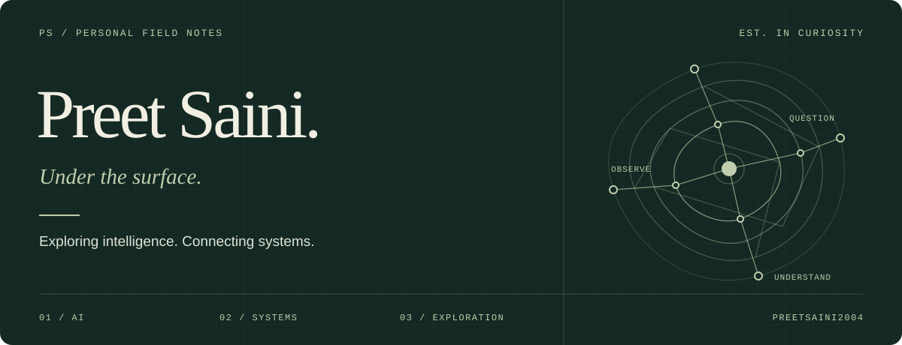

<picture>
  
</picture>

 

### AI is the next chapter.

I'm Preet. I'm getting deeper into **artificial intelligence**, and making it the main direction of my upcoming work on GitHub.

My interests in ethical hacking, networking, and games still shape my curiosity. Now, that curiosity is pointing toward AI: learning how it works, experimenting with it, and turning ideas into projects.

 

### Where I'm headed

| 01 — Main focus | 02 — Upcoming work | 03 — Foundation |
| :--- | :--- | :--- |
| Learning and experimenting with AI. | Building projects around artificial intelligence. | Ethical hacking, networking, and games. |

 

---

**Let's talk AI** · [Email me](mailto:Preet.saini.0@outlook.com) · [Explore my repositories](https://github.com/preetsaini2004?tab=repositories)

Preet Saini &nbsp; / &nbsp; Under the surface.
